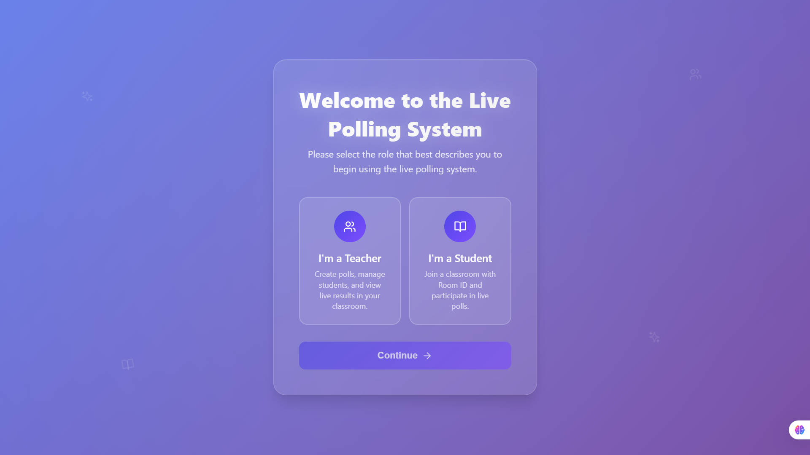
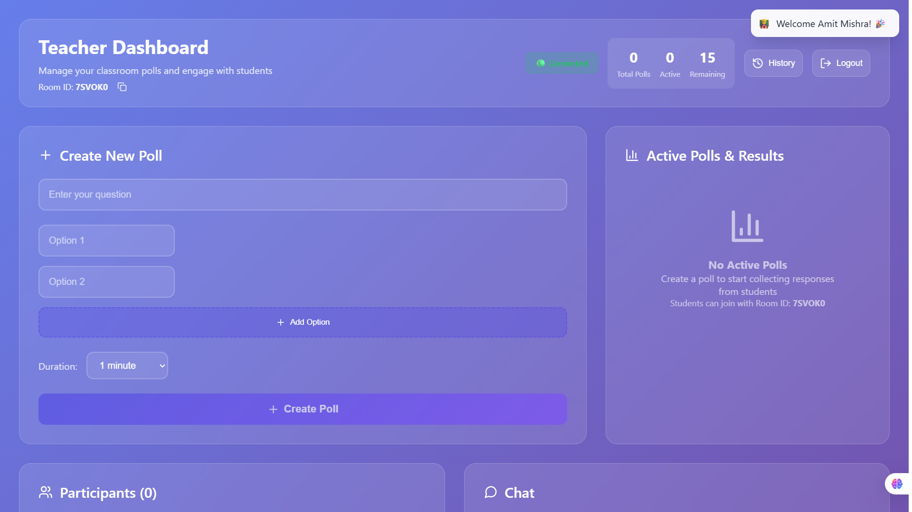
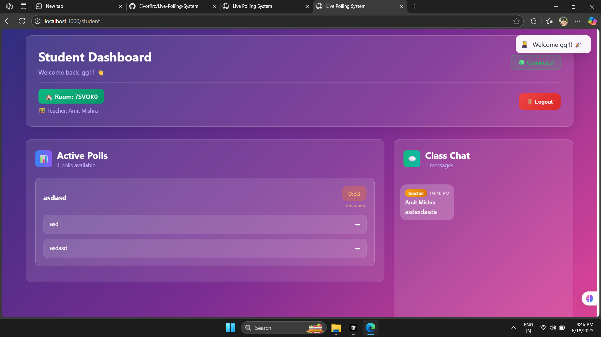
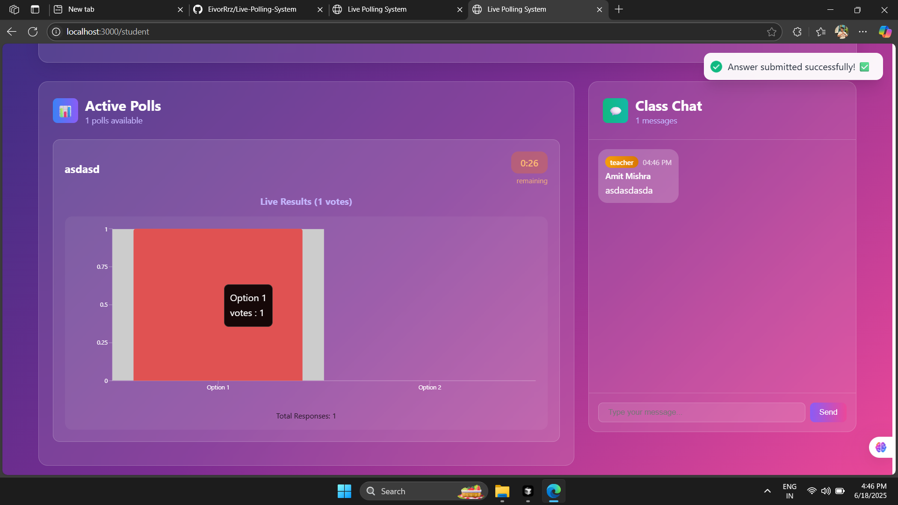

# 🗳️ Live Polling System

A real-time interactive polling application that enables teachers to create live polls and students to participate in real-time. Built with React, Node.js, Express, Socket.io, and MongoDB.

## 📸 Screenshots

### Landing Page

*Choose your role - Teacher or Student to get started*

### Teacher Dashboard

*Create polls, manage students, and view real-time results*

### Student Dashboard

*Join classroom and participate in live polls*

### Student Dashboard - Live Results

*View real-time poll results with interactive charts*

## ✨ Features

### For Teachers:
- 👨‍🏫 **Teacher Dashboard**: Create and manage classroom polls
- 📊 **Real-time Results**: View live poll results with interactive charts
- 👥 **Student Management**: See connected students in real-time
- 💬 **Live Chat**: Communicate with students through integrated chat
- ⏱️ **Timed Polls**: Set custom durations for polls
- 📈 **Poll History**: Access previous poll results and analytics

### For Students:
- 🎓 **Student Dashboard**: Join classrooms using Room ID
- 🗳️ **Live Voting**: Participate in real-time polls
- 💬 **Class Chat**: Engage in classroom discussions
- 📊 **Live Results**: See poll results update in real-time
- 🔔 **Notifications**: Get notified of new polls and updates

### General Features:
- 🚀 **Real-time Communication**: Powered by Socket.io for instant updates
- 📱 **Responsive Design**: Works seamlessly on desktop and mobile
- 🎨 **Modern UI**: Beautiful gradient design with smooth animations
- 🔒 **Room-based System**: Secure classroom separation with unique Room IDs
- ⚡ **Fast Performance**: Optimized for quick poll creation and response

## 🛠️ Tech Stack

### Frontend:
- **React 18** - UI framework
- **React Router** - Navigation
- **Socket.io Client** - Real-time communication
- **Recharts** - Data visualization
- **Framer Motion** - Animations
- **React Hot Toast** - Notifications
- **Styled Components** - Styling
- **Lucide React** - Icons

### Backend:
- **Node.js** - Runtime environment
- **Express.js** - Web framework
- **Socket.io** - Real-time communication
- **MongoDB** - Database
- **Mongoose** - ODM for MongoDB
- **CORS** - Cross-origin resource sharing
- **dotenv** - Environment variables

## 🚀 Quick Start

### Prerequisites
- Node.js (v14 or higher)
- MongoDB
- npm or yarn

### Installation

1. **Clone the repository**
```bash
git clone https://github.com/yourusername/live-polling-system.git
cd live-polling-system
```

2. **Install dependencies**

For the backend:
```bash
cd Server
npm install
```

For the frontend:
```bash
cd frontend
npm install
```

3. **Environment Setup**

Create a `.env` file in the `Server` directory:
```env
PORT=5000
MONGODB_URI=mongodb://localhost:27017/polling-system
NODE_ENV=development
```

4. **Start the application**

Start the backend server:
```bash
cd Server
npm start
```

Start the frontend (in a new terminal):
```bash
cd frontend
npm start
```

5. **Access the application**
- Frontend: http://localhost:3000
- Backend API: http://localhost:5000

## 🏗️ Project Structure

```
live-polling-system/
├── frontend/                 # React frontend
│   ├── src/
│   │   ├── components/      # React components
│   │   │   ├── LandingPage.js
│   │   │   ├── TeacherDashboard.js
│   │   │   ├── StudentDashboard.js
│   │   │   └── LoadingScreen.js
│   │   ├── context/         # React contexts
│   │   │   ├── SocketContext.js
│   │   │   └── UserContext.js
│   │   ├── App.js
│   │   └── index.js
│   └── package.json
├── Server/                   # Node.js backend
│   ├── controller/          # Route controllers
│   │   ├── chatController.js
│   │   ├── pollController.js
│   │   └── userController.js
│   ├── model/              # MongoDB models
│   │   ├── Message.js
│   │   ├── Poll.js
│   │   ├── Room.js
│   │   └── User.js
│   ├── config/             # Database configuration
│   │   └── DB.js
│   ├── socket/             # Socket.io configuration
│   │   └── index.js
│   ├── server.js           # Main server file
│   └── package.json
├── api/                    # Vercel API endpoints
│   └── index.js
├── vercel.json            # Vercel deployment config
└── README.md
```

## 🌐 Deployment

### Vercel Deployment

This project is configured for easy deployment on Vercel:

1. **Connect to GitHub**: Push your code to a GitHub repository

2. **Deploy to Vercel**:
```bash
npm install -g vercel
vercel login
vercel --prod
```

3. **Environment Variables**: Set up your environment variables in the Vercel dashboard:
   - `MONGODB_URI`: Your MongoDB connection string
   - `NODE_ENV`: Set to "production"

### Manual Deployment

For other platforms, build the frontend:
```bash
cd frontend
npm run build
```

## 📱 How to Use

### For Teachers:
1. Select "I'm a Teacher" on the landing page
2. Enter your name to create a classroom
3. Share the generated Room ID with students
4. Create polls with custom questions and options
5. Monitor live results and chat with students

### For Students:
1. Select "I'm a Student" on the landing page
2. Enter your name and the Room ID provided by teacher
3. Participate in live polls as they become available
4. Chat with classmates and teacher
5. View real-time poll results

## 🎯 Key Features Demo

- **Real-time Polling**: Questions appear instantly for all connected students
- **Live Results**: Charts update automatically as votes are submitted
- **Interactive Chat**: Teachers and students can communicate in real-time
- **Room Management**: Each classroom is isolated with unique Room IDs
- **Responsive Design**: Works perfectly on mobile devices

## 🤝 Contributing

1. Fork the repository
2. Create a feature branch (`git checkout -b feature/AmazingFeature`)
3. Commit your changes (`git commit -m 'Add some AmazingFeature'`)
4. Push to the branch (`git push origin feature/AmazingFeature`)
5. Open a Pull Request

## 📄 License

This project is licensed under the MIT License - see the [LICENSE](LICENSE) file for details.

## 🙏 Acknowledgments

- Built for Interview.io technical assessment
- Inspired by modern classroom engagement tools
- UI/UX designed with accessibility in mind

## 📞 Contact

**Developer**: Amit Mishra  
**Email**: eivorftw234@gmail.com  
**GitHub**: [@yourusername](https://github.com/yourusername)

---

⭐ Star this repository if you found it helpful!
